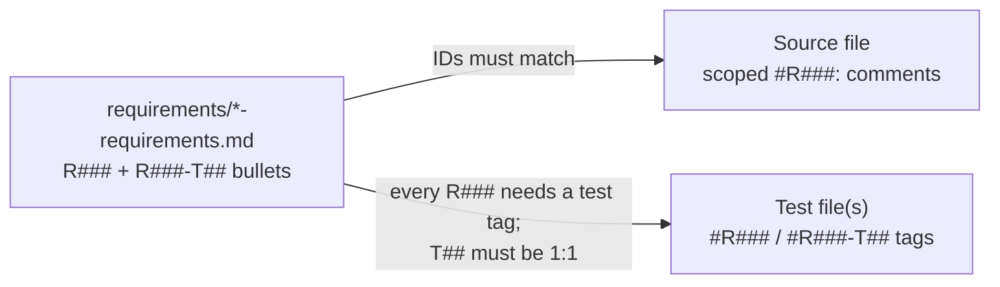

# Fix Requirements Traceability Failures

## Context

The verifier (`[00_verify_requirements_traceability.sh](00_verify_requirements_traceability.sh)`) enforces three layers per requirements doc:




**13 failures** fall into 6 independent workstreams. Most gaps are **traceability metadata** (tags/docs), not missing behavior.

---

## Workstream 1: `07_run_security_checks` (3 failures)

**Root cause:** R065/R070/R075 are defined in `[requirements/07_run_security_checks-requirements.md](requirements/07_run_security_checks-requirements.md)` and partially tested, but `[07_run_security_checks.sh](07_run_security_checks.sh)` lacks scoped source tags. R075 has no bats test.

**Source tags to add** (scoped `#Rxxx:` form, matching existing style like `#R055:`):


| ID   | Anchor in script                                                                                 | Tag intent                                              |
| ---- | ------------------------------------------------------------------------------------------------ | ------------------------------------------------------- |
| R065 | Default `SCHEMATHESIS_SCHEMA_PATH` / OpenAPI usage (~lines 31–32, 826)                           | Canonical OpenAPI documents credential routes           |
| R070 | Defaults block (~~34–36), `resolve_dast_ignored_alert_refs` (~~73–85), auto-boot dev auth (~870) | Schemathesis defaults + https 10106 handling + dev auth |
| R075 | `DAST_RUN_ID` assignment (~~855–858), `cleanup_dast_tenant_data` (~~88–105, 1219–1220)           | Tenant-prefixed row cleanup after DAST                  |


**Test to add** in `[tests/sh/07_run_security_checks.bats](tests/sh/07_run_security_checks.bats)`:

- `@test "auto-boot emits dast run id for tenant cleanup"` with `#R075-T01` + `#R075`
- Grep or stub-based assertion that auto-boot path prints `DAST run id (tenant cleanup prefix):` (line 858)

R065-T01 and R070-T01 already pass — no test changes needed there.

---

## Workstream 2: `12_run_fuzz` (3 failures)

**Root cause:** `[12_run_fuzz.sh](12_run_fuzz.sh)` only tags `#R001`. R005/R010/R015/R020 behavior exists but is untagged. R020 tests are missing.

**Source tags to add:**


| ID   | Anchor                                              | Tag intent                                                |
| ---- | --------------------------------------------------- | --------------------------------------------------------- |
| R005 | `go` availability check (lines 13–16)               | Fail fast when go missing                                 |
| R010 | `FUZZ_PACKAGES` / `FUZZ_TIME` defaults (lines 9–10) | Default packages and runtime                              |
| R015 | Success line (line 58)                              | Pass marker on completion                                 |
| R020 | Comment near fuzz loop                              | `new interesting: 0` is informational, not a gate failure |


**Tests to add** in `[tests/sh/12_run_fuzz.bats](tests/sh/12_run_fuzz.bats)`:

- **R020-T01:** grep `[README.md](README.md)` (~297–299) for non-failing `new interesting` guidance
- **R020-T02:** extend `make_go_fuzz_stub` to print `new interesting: 0`, run script, assert exit 0 + pass output

Existing R005/R010/R015 tests pass once source tags are added.

---

## Workstream 3: `internal/credentials` numbered-test-tags (6 failures)

**Root cause:** R001-T08/T10 are declared in all six credentials requirements files but `[internal/credentials/validation_test.go](internal/credentials/validation_test.go)` only lists supplemental tags T05–T07, T09, T11. Subtests `invalid_public_key` and `valid_ed25519` already cover the behavior.

**Fix (single file, clears all 6 failures):**

Add to the supplemental header block in `validation_test.go`:

```go
// #R001-T08
// #R001-T10
```

This matches the existing pattern used for T05–T07 and satisfies the verifier's package-level test discovery for handler/ids/service/signing_contract/types/validation docs.

**Optional follow-up (not in current failure list):** R001-T09 (wrong decoded key length) has no table-driven case — consider adding later for fuller matrix coverage.

---

## Workstream 4: `validation.go` extra R020 (2 failures: source + numbered-test-tags)

**Root cause:** `[internal/credentials/validation.go](internal/credentials/validation.go)` tags `ValidateListQuery` as `#R020`, but `[requirements/internal/credentials/validation-requirements.md](requirements/internal/credentials/validation-requirements.md)` has no R020. Tests exist in `TestValidateListQueryScenarios` but carry no tags.

**Fix — add requirement (do not remove source tag):**

Add to `validation-requirements.md`:

```markdown
R020  Statement: List query validation must reject empty, oversized, or invalid UTF-8 tenant/install identifiers.
Design: ValidateListQuery returns an error when tenant_id or install_id is empty, exceeds 256 chars, contains NUL, or is invalid UTF-8.
Tests:
- R020-T01: Verify empty tenant_id returns an error.
- R020-T02: Verify invalid UTF-8 tenant_id returns an error.
```

Add supplemental tags in `validation_test.go`:

```go
// #R020-T01  (maps to empty_tenant subtest)
// #R020-T02  (maps to invalid_utf8 subtest)
// #R020
```

Note: `service-requirements.md` R020 is a separate ID scoped to upload-target discovery — no conflict.

---

## Workstream 5: `httpserver` extra R020 (1 failure)

**Root cause:** `[internal/httpserver/server.go](internal/httpserver/server.go)` and `[server_test.go](internal/httpserver/server_test.go)` already implement and test 405 + `Allow` header behavior under `#R020`, but `[requirements/internal/httpserver/server-requirements.md](requirements/internal/httpserver/server-requirements.md)` stops at R015.

**Fix — add requirement block only:**

```markdown
R020  Statement: Unsupported HTTP methods must return RFC 9110-compliant 405 responses with an Allow header.
Design: router.MethodNotAllowed(methodNotAllowedHandler) sets Allow, Content-Type, HTTP 405, and JSON error body.
Tests:
- R020-T01: Verify unsupported method (e.g. QUERY on /healthz) returns 405 with non-empty Allow header.
```

No source or test changes needed.

---

## Workstream 6: macOS Swift test tag drift (2 failures)

### AppLifecycle

**Root cause:** `[AppLifecycleTests.swift](macos/ValveProvisioningApp/Tests/ValveFeaturesTests/AppLifecycleTests.swift)` uses `#R001-T03` on the delegate test, but `[AppLifecycle-requirements.md](requirements/macos/ValveProvisioningApp/Sources/ValveFeatures/AppLifecycle-requirements.md)` only declares T01/T02. The policy test incorrectly claims both T01 and T02.

**Fix — retag tests (preferred over adding redundant T03 bullet):**


| Test                                                  | Current tags | Correct tags                          |
| ----------------------------------------------------- | ------------ | ------------------------------------- |
| `appLifecyclePolicyTerminatesAfterLastWindowClosed`   | T01 + T02    | **T02 only**                          |
| `appLifecycleDelegateTerminatesAfterLastWindowClosed` | T03          | **T01** (matches requirements bullet) |


### RootView

**Root cause:** `[RootViewTests.swift](macos/ValveProvisioningApp/Tests/ValveFeaturesTests/RootViewTests.swift)` mis-tags env-init as `#R001-T03` and health check as `#R005-T03`. `[RootView-requirements.md](requirements/macos/ValveProvisioningApp/Sources/ValveFeatures/RootView-requirements.md)` declares T03 as `refreshList` (untested) and has no R005-T03.

**Fix:**

1. **Update requirements** — add bullets and fix Scope:
  - Scope: include `RootViewTests.swift` alongside `InventoryCopyTests.swift`
  - R001-T04: env-init from AppContext
  - R001-T05: `checkHealth` sets `isHealthy` when health+readiness succeed
  - Keep R001-T03 as refreshList
2. **Retag tests in `RootViewTests.swift`:**
  - env-init: `#R001-T03` → `#R001-T04`
  - health check: `#R005-T03` → `#R001-T05`
3. **Add missing R001-T03 test** — stub API returning credential records, call `refreshList()`, assert `records` populated; tag `#R001-T03`
4. **Clean orphan supplemental tags** in `[InventoryCopyTests.swift](macos/ValveProvisioningApp/Tests/ValveFeaturesTests/InventoryCopyTests.swift)` (file-level `// #R001-T02` / `// #R001-T03` with no matching test body)

---

## Workstream 7: `11_run_llm_evals` missing coverage (1 failure, largest net-new work)

**Root cause:** `[11_run_llm_evals.sh](11_run_llm_evals.sh)` exists with no `[requirements/11_run_llm_evals-requirements.md](requirements/11_run_llm_evals-requirements.md)`, no `[tests/sh/11_run_llm_evals.bats](tests/sh/11_run_llm_evals.bats)`, and zero `#R` tags.

**Create requirements doc** modeled after `[requirements/12_run_fuzz-requirements.md](requirements/12_run_fuzz-requirements.md)` and script behavior:


| ID   | Statement (summary)                                                               |
| ---- | --------------------------------------------------------------------------------- |
| R001 | Strict mode, cd to repo root                                                      |
| R005 | Fail fast when `go` or `1psa` missing                                             |
| R010 | Fail fast when QED repo/entrypoint missing; configurable `QED_REPO_PATH`          |
| R015 | Validate mode argument; print usage on invalid mode                               |
| R020 | Read OpenAI/Anthropic keys from 1psa; fail on empty                               |
| R025 | Default mode `run`; dispatch recorded suite evals via `go -C` qed                 |
| R030 | Support `save-baseline`, `compare`, `all`, `repo-quality-only` modes              |
| R035 | `live-only` mode: skip gracefully without DB URL; probe healthz before live suite |


Each requirement needs R###-T## bullets and matching scoped tags in the script.

**Create bats suite** with stubbed `go`, `1psa`, and qed entrypoint (pattern from `[tests/sh/12_run_fuzz.bats](tests/sh/12_run_fuzz.bats)` + `[tests/sh/06_run_mutation_tests.bats](tests/sh/06_run_mutation_tests.bats)`):

- Missing-tool failure tests (R005)
- Invalid mode usage (R015)
- Default `run` mode invokes expected suite paths (R025)
- `repo-quality-only` runs single suite (R030)
- `live-only` without DB URL exits 0 with skip message (R035)

**Add scoped `#Rxxx:` tags** throughout `11_run_llm_evals.sh` at each implementing block.

---

## Suggested implementation order

1. **Quick wins** — credentials T08/T10 tags, httpserver R020 requirement, AppLifecycle retags (~15 min)
2. **Medium shell fixes** — 07 and 12 source tags + missing bats tests (~30 min)
3. **validation R020** — requirements + test tags (~15 min)
4. **RootView** — requirements update, retags, new refreshList test (~30 min)
5. **11_run_llm_evals** — full requirements + script tags + bats suite (~60 min)

---

## Verification

After all changes, re-run:

```bash
./00_verify_requirements_traceability.sh
```

Target: **45/45 pass**, summary `total=45 pass=45 fail=0`.

Optionally run affected test suites:

```bash
bats tests/sh/07_run_security_checks.bats tests/sh/12_run_fuzz.bats
# after 11 is created:
bats tests/sh/11_run_llm_evals.bats
go test ./internal/credentials/... ./internal/httpserver/...
swift test --package-path macos/ValveProvisioningApp
```

