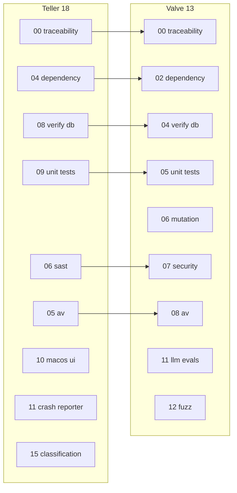

# Port teller 18 → valve 13 parallel meta-runner

## Source and target

Copy the full traceability trio from teller:

| Teller | Valve |
|--------|-------|
| [`../teller/18_run_all_checks_parallel.sh`](../teller/18_run_all_checks_parallel.sh) | [`13_run_all_checks_parallel.sh`](13_run_all_checks_parallel.sh) |
| [`../teller/requirements/18_run_all_checks_parallel-requirements.md`](../teller/requirements/18_run_all_checks_parallel-requirements.md) | [`requirements/13_run_all_checks_parallel-requirements.md`](requirements/13_run_all_checks_parallel-requirements.md) |
| [`../teller/tests/sh/18_run_all_checks_parallel.bats`](../teller/tests/sh/18_run_all_checks_parallel.bats) | [`tests/sh/13_run_all_checks_parallel.bats`](tests/sh/13_run_all_checks_parallel.bats) |

Keep the orchestrator logic intact (parallel launch, per-check log capture, completion-order PASS/FAIL lines, progress bar, single-run lock, SIGINT/SIGTERM child cleanup, `PARALLEL_CHECKS_TEST_INTERRUPT` test hook). Only renumber **18 → 13** and reswizzle valve-specific names.

## Valve checklist (9 scripts)

Replace teller's nine scripts with valve's gate scripts (matches README Security Checks runbook + traceability/freshness/deploy verify):

```bash
CHECKS=(
  "00_verify_requirements_traceability.sh"
  "02_run_dependency_freshness_checks.sh"
  "04_verify_deploy_database.sh"
  "05_run_unit_tests.sh"
  "06_run_mutation_tests.sh"
  "07_run_security_checks.sh"
  "08_run_av_checks.sh"
  "11_run_llm_evals.sh"   # defaults to `run` when no args
  "12_run_fuzz.sh"
)
```

**Excluded** (setup/ops/interactive, not CI gates): `01_install_prerequisites.sh`, `03_deploy_database.sh`, `09_run_backend.sh`, `10_launch_ui.sh`, `97_*`/`98_*`/`99_*`.

Teller → valve mapping for reference:



## Script reswizzle ([`13_run_all_checks_parallel.sh`](13_run_all_checks_parallel.sh))

Mechanical renames from teller source:

- Lock file: `.13_run_all_checks_parallel.lock`
- Error strings: `13_run_all_checks_parallel.sh`
- `CHECKS` array → valve list above

**Valve-only addition** (already anticipated in [`.cursor/plans/speed_up_bats_suite_e95eabb6.plan.md`](.cursor/plans/speed_up_bats_suite_e95eabb6.plan.md); [`05_run_unit_tests.sh`](05_run_unit_tests.sh) already implements the consumer side at lines 201–205):

```bash
export PARALLEL_LANES="${#CHECKS[@]}"
```

Insert immediately before the `#R015: Launch all check scripts concurrently` loop so inner bats parallelism stays near `hw.ncpu` when all nine lanes run at once.

## Requirements reswizzle ([`requirements/13_run_all_checks_parallel-requirements.md`](requirements/13_run_all_checks_parallel-requirements.md))

- Scope: `Applies to 13_run_all_checks_parallel.sh.`
- **R010**: list the nine valve scripts (not teller's macOS/classification scripts)
- **R040-T01**: grep the nine valve child scripts for `run_all_checks_parallel`
- **New R046** (or fold into R015): export `PARALLEL_LANES="${#CHECKS[@]}"` before launching children so nested parallel runners (notably `05_run_unit_tests.sh`) divide their job count
- Changelog entry: `2026-05-20: Reswizzled from teller 18_run_all_checks_parallel.sh for valve check scripts and PARALLEL_LANES composition.`

All other requirement IDs (R001, R005, R015–R055) stay structurally identical; progress bar totals remain `9/9`.

## Bats reswizzle ([`tests/sh/13_run_all_checks_parallel.bats`](tests/sh/13_run_all_checks_parallel.bats))

Port teller's bats file with these substitutions:

| Test concern | Teller reference | Valve reference |
|--------------|------------------|-----------------|
| Missing script fast-fail | `09_run_unit_tests.sh` | `05_run_unit_tests.sh` |
| Single failed child | `09_run_unit_tests.sh` stub | `05_run_unit_tests.sh` stub |
| Log artifact marker | `05_run_av_checks.sh` | `08_run_av_checks.sh` |
| Completion-order timing | `00` slow / `04` fast | `00` slow / `02` fast |
| Lock file path | `.18_run_all_checks_parallel.lock` | `.13_run_all_checks_parallel.lock` |
| Fixture script | `18_run_all_checks_parallel.sh` | `13_run_all_checks_parallel.sh` |

Update traceability header comments to reference `requirements/13_run_all_checks_parallel-requirements.md`. Reuse existing [`tests/sh/helpers/common.bash`](tests/sh/helpers/common.bash) helpers (`setup_shell_test`, `create_repo_fixture`, `copy_script_to_fixture`).

## README (small doc touch)

Add a short subsection under **Security Checks (Operator Runbook)** in [`README.md`](README.md):

```bash
./13_run_all_checks_parallel.sh
```

Note that per-check output lands in `.parallel-checks-reports/<script-stem>.log` and only PASS/FAIL lines stream live (same model as teller 18).

## Verification

After implementation:

```bash
bats tests/sh/13_run_all_checks_parallel.bats
./00_verify_requirements_traceability.sh requirements/13_run_all_checks_parallel-requirements.md 13_run_all_checks_parallel.sh
./13_run_all_checks_parallel.sh   # optional full integration; requires local deps (1psa, postgres, qed, etc.)
```

## Notes / non-goals

- **No changes to child check scripts** except what traceability requires (they must not reference `run_all_checks_parallel`).
- **`05_run_unit_tests.sh` PARALLEL_LANES support is already done** — no further work needed there.
- **Bootstrap dependency**: first `./13_*` run will fail its `00` child until the trio exists; expected and self-enforcing (same as teller).
- **Parallel resource contention**: running `07_run_security_checks.sh` (DAST auto-boot) alongside eight other heavy lanes may stress the host; DAST probe knobs already exist in [`07_run_security_checks.sh`](07_run_security_checks.sh). Full integration runs are operator-opt-in; unit tests use stubs.
