# Valve Testing Maturity — Full Roadmap

Source: exported assessment in [`cursor_testing_maturity_assessment_of_r.md`](/Users/phil/Desktop/cursor_testing_maturity_assessment_of_r.md). Repo baseline is already strong (mutation gates, Rxxx traceability, 201 Bats cases, LLM repo-quality eval). This plan closes the **known gaps** without rewriting working harness plumbing in [`07_run_security_checks.sh`](07_run_security_checks.sh) / [`08_run_av_checks.sh`](08_run_av_checks.sh).

```mermaid
flowchart LR
  subgraph phase1 [Phase1_Gates]
    SAST[SAST_green]
  end
  subgraph phase2 [Phase2_SecuritySignal]
    OAS[OpenAPI_5of5]
    SCH[Schemathesis_all]
    EICAR[EICAR_AV]
  end
  subgraph phase3 [Phase3_GoDepth]
    FUZZ[Go_fuzz]
    COV[Coverage_floor]
    TABLE[Table_subtests]
  end
  subgraph phase4 [Phase4_Hardening]
    DASTpolish[DAST_AV_polish]
    MUTpkg[Mutation_by_pkg]
  end
  subgraph phase5 [Phase5_Platform]
    SWIFT[Swift_UI]
    QED[Live_QED]
  end
  subgraph phase6 [Phase6_Future]
    LOAD[Load_chaos]
  end
  phase1 --> phase2 --> phase3 --> phase4 --> phase5 --> phase6
```



---

## Phase 1 — Restore trust in the top gate (SAST)

**Goal:** `sast-summary.json` shows `gate_failed: false` and `detect_secrets_findings: 0` (assessment: 6 findings blocking score).

**Current state:**
- Prior work tracked in [`.cursor/plans/resolve_detect-secrets_false_positive_f1f9d7d8.plan.md`](.cursor/plans/resolve_detect-secrets_false_positive_f1f9d7d8.plan.md) (backend fixture URL) is marked complete; assessment may reflect **additional** findings or a stale report.
- Git status shows untracked [`.kiro/specs/detect-secrets-false-positives/`](.kiro/specs/detect-secrets-false-positives/) — use as the working spec if present locally; otherwise recreate from assessment notes.

**Work:**
1. Run `./07_run_security_checks.sh` with `RUN_DAST=false` (faster) and capture `detect-secrets.json` + `sast-summary.json`.
2. For each in-scope finding, prefer **source fixes** over suppressions (match completed plan rationale):
   - Split credential-shaped literals in Bats/fixtures (pattern already used in [`tests/sh/08_run_backend.bats`](tests/sh/08_run_backend.bats)).
   - Use `# pragma: allowlist secret` only where the string is intentionally non-secret (see [`README.md`](README.md) line 65, [`internal/config/config_test.go`](internal/config/config_test.go)).
3. Extend [`tests/sh/07_run_security_checks.bats`](tests/sh/07_run_security_checks.bats) only if exclusion-regex or counting behavior changes.
4. Update [`requirements/07_run_security_checks-requirements.md`](requirements/07_run_security_checks-requirements.md) changelog if policy shifts.

**Exit criteria:** `./07_run_security_checks.sh` passes SAST lane; existing R020 detect-secrets Bats still pass.

---

## Phase 2 — DAST + AV: security signal (harness stays; scanners get teeth)

### 2a. Expand OpenAPI to match real routes

**Problem:** [`openapi/valve.v1.yaml`](openapi/valve.v1.yaml) documents 2 paths; server registers 5 credential routes + upload-target ([`internal/httpserver/server.go`](internal/httpserver/server.go) lines 54–65).

**Add paths** (mirror [`README.md`](README.md) API section and Go types in [`internal/credentials/types.go`](internal/credentials/types.go)):

| Path | Method | Auth |
|------|--------|------|
| `/v1/valve/credentials/register` | POST | none |
| `/v1/valve/credentials/revoke` | POST | none |
| `/v1/valve/credentials/rotate` | POST | none |
| `/v1/valve/credentials/` | GET | none (query: `tenant_id`, `install_id`) |
| `/v1/valve/credentials/{credential_id}/verification` | GET | `ValveServiceKey` |
| (existing) `/healthz`, `/v1/piston/upload-target` | | |

**Schemas:** `RegisterRequest/Response`, `Revoke*`, `Rotate*`, `ListResponse`, `VerificationResponse`, reuse `ErrorResponse`.

**OpenAPI links** (assessment priority): declare `operationId`s and `links` for stateful flows, e.g.:
- `register` → `revoke` (pass `credential_id` from response)
- `register` → `rotate` (pass `old_credential_id`)

**Tests:** New/updated cases in [`tests/sh/07_run_security_checks.bats`](tests/sh/07_run_security_checks.bats) asserting Schemathesis stub receives expanded schema; optional golden `schemathesis-junit.xml` fixture with >2 testcases.

**Requirements:** Extend R040/R055 in [`requirements/07_run_security_checks-requirements.md`](requirements/07_run_security_checks-requirements.md) for “canonical schema covers all credential routes.”

### 2b. Strengthen Schemathesis defaults in `07_run_security_checks.sh`

Current invocation ([`07_run_security_checks.sh`](07_run_security_checks.sh) ~951–955):

- `--mode positive` → default to **`all`** (env `SCHEMATHESIS_MODE`, default `all`)
- `--max-examples 25` → default **200** (keep override via `SCHEMATHESIS_MAX_EXAMPLES`)
- Add **`--checks all`** when supported by installed Schemathesis version
- **Seed:** keep `SCHEMATHESIS_SEED` for CI; document `SCHEMATHESIS_SEED=$(date +%s)` for nightly exploration
- **HTTPS alert 10106:** auto-drop from `DAST_IGNORED_ALERT_REFS` when `DAST_BASE_URL` scheme is `https` (assessment item 8)

### 2c. ZAP surface + DAST hygiene

- Default `DAST_ZAP_TARGET_URL` to a path that returns 200 with auth context, or add **multi-target** env (`DAST_ZAP_TARGET_URLS` comma-separated) starting with `/healthz` + one authenticated JSON route once OpenAPI bootstraps credentials.
- **DAST tenant isolation:** on auto-boot, set `tenant_id` prefix `dast_run_<uuid>` and post-run cleanup SQL (`DELETE` audit/credential rows for that prefix) — requires wiring env in auto-boot block (~820–870).
- Document operator knobs in README security section.

### 2d. EICAR end-to-end AV proof

**Highest-impact AV item** (assessment):

1. Add [`tests/fixtures/eicar.txt`](tests/fixtures/eicar.txt) with canonical EICAR test string (document as intentional test malware).
2. New Bats case in [`tests/sh/08_run_av_checks.bats`](tests/sh/08_run_av_checks.bats): `CLAMAV_SCAN_TARGET=tests/fixtures`, **real** `clamscan` (skip if `clamscan` missing via `skip` helper), assert `infected_files >= 1` and `gate_failed == true`.
3. Gate tag: `@test` marked optional in CI matrix OR run only when `RUN_CLAMAV_E2E=true` so laptops without ClamAV do not break `05_run_unit_tests.sh` — **decision:** keep EICAR out of default `05` chain; run from `08` when ClamAV installed (matches existing `08` optional tooling pattern).

### 2e. AV hardening (same phase, smaller deltas)

In [`08_run_av_checks.sh`](08_run_av_checks.sh) + [`tests/sh/08_run_av_checks.bats`](tests/sh/08_run_av_checks.bats):

| Item | Change |
|------|--------|
| Stale signatures gate | `CLAMAV_SIGNATURE_MAX_AGE_HOURS_HARD_FAIL` (default 168h) → fail lane |
| `scanned_files > 0` assert | When `skipped=false`, fail if parser yields 0 scanned |
| `freshclam` failure | If retry path runs `freshclam` and it exits non-zero, fail with explicit message before second `clamscan` |
| Allowlist | `CLAMAV_ALLOWLIST_SIGNATURES` (comma-separated signature names) |
| Scan targets | Document/build-target scan: `./valve` binary post-`go build` + optional `.gomodcache` path via env |
| `SECURITY_FAIL_ON_HIGH_CRITICAL` | Document that AV ignores this semantically (infection always critical); do not use toggle to silence AV |

Update [`requirements/08_run_av_checks-requirements.md`](requirements/08_run_av_checks-requirements.md) with new Rxxx bullets + Bats IDs per repo convention.

**Phase 2 exit:** Schemathesis JUnit shows credential endpoints; EICAR proves real ClamAV; `./07` + `./08` pass with strengthened defaults.

---

## Phase 3 — Go test depth (fuzz, coverage, structure)

### 3a. Native fuzz tests

**Targets** (assessment; align to actual code — verification crypto lives in Manifold; Valve owns **validation**):

| Fuzz function | Package | Fuzzes |
|---------------|---------|--------|
| `FuzzValidateRegister` | `internal/credentials` | [`validation.go`](internal/credentials/validation.go) `ValidateRegister` |
| `FuzzValidateRevoke` | same | `ValidateRevoke` |
| `FuzzValidateRotate` | same | `ValidateRotate` |
| `FuzzServiceAuthMiddleware` or header parsing | `internal/security` | untrusted header bytes |

Add `*_fuzz_test.go` files; seed corpus under `testdata/fuzz/` from failing inputs.

**Runner:** New [`12_run_fuzz.sh`](12_run_fuzz.sh) (assessment suggestion):

```bash
go test ./internal/credentials ./internal/security -fuzz=. -fuzztime=30s
```

Wire into CI after unit tests: either call from [`06_run_mutation_tests.sh`](06_run_mutation_tests.sh) preflight or from [`05_run_unit_tests.sh`](05_run_unit_tests.sh) behind `RUN_FUZZ=true` (prefer **separate script** to keep `05` fast).

**Requirements:** `requirements/12_run_fuzz-requirements.md` + Bats `tests/sh/12_run_fuzz.bats` (stub `go` like other scripts).

### 3b. Line coverage floor

In [`05_run_unit_tests.sh`](05_run_unit_tests.sh) after `go test ./...`:

- Run `go test ./... -coverprofile=/tmp/valve.cover` (or merge with test pass in one invocation)
- Parse total coverage %; fail if below `GO_COVERAGE_THRESHOLD` (default **80**)
- Emit `coverage-summary.json` under `.security-reports/` for parity with mutation summary

**Note:** Complements mutation gate ([`06_run_mutation_tests.sh`](06_run_mutation_tests.sh)) — catches files gremlins never mutates.

### 3c. Table-driven subtests + parallelism

Refactor largest repeat setup in [`internal/credentials/service_test.go`](internal/credentials/service_test.go) (~746 LOC) and [`handler_test.go`](internal/credentials/handler_test.go):

- Convert independent cases to `t.Run("case_name", ...)`
- Use `t.Parallel()` only where stores/mocks are isolated (avoid shared `fakeStore` races)
- Preserve existing `#Rxxx-Txx` traceability comments on subtests

**Exit criteria:** `go test` passes; failure output shows subtest names; no new `[no test files]` packages.

---

## Phase 4 — Operator-script and mutation observability polish

### 4a. Mutation summary per package

Extend gremlins JSON post-processing in [`06_run_mutation_tests.sh`](06_run_mutation_tests.sh) (~195–260) to add `by_package` map (path prefix → killed/lived/not_covered). Surface in `mutation-summary.json` and one-line operator summary.

### 4b. DAST/AV remaining assessment items

- ZAP: evaluate active scan behind `DAST_ZAP_ACTIVE=true` (longer timeout) — **spike only**; baseline remains default
- README: security runbook for prod DAST (`https`, remove `10106`, rotate seed)

### 4c. Script numbering / docs

Assessment references `06_run_security_checks.sh` — repo uses **`07`**. Ensure README and [`11_run_llm_evals.sh`](11_run_llm_evals.sh) document correct script order (`05` → `06` mutation → `07` security → `08` AV → `11` evals).

---

## Phase 5 — Swift UI + live QED evals

### 5a. macOS app tests

- Add [`macos/ValveProvisioningApp/Tests/RootViewTests.swift`](macos/ValveProvisioningApp/Tests/RootViewTests.swift) for [`RootView.swift`](macos/ValveProvisioningApp/Sources/ValveFeatures/RootView.swift) (view model / state, not full snapshot initially)
- Expand [`AppLifecycleTests.swift`](macos/ValveProvisioningApp/Tests/) beyond 10 LOC
- Optional later: snapshot tests via `swift-snapshot-testing` (new dependency — defer unless requested)

Update matching `requirements/macos/**` docs.

### 5b. Live QED integration (largest epic)

Today [`.qed/evals/README.md`](.qed/evals/README.md) is **recorded-only**. Assessment blind spot.

**Incremental approach:**

1. **Hybrid dataset** `datasets/api_live_smoke.jsonl` — cases that require `VALVE_DATABASE_URL` + running valve (skip when unset, like [`postgres_integration_test.go`](internal/storage/postgres_integration_test.go)).
2. New spec [`.qed/evals/api_live.yaml`](.qed/evals/api_live.yaml) with `requires_live: true`.
3. Extend [`11_run_llm_evals.sh`](11_run_llm_evals.sh): `live-only` mode that boots valve via same setsid pattern as `07` or expects pre-running service.
4. Keep recorded suites as fast default; live suite runs in nightly / pre-release only.

**Do not** remove recorded evals — they gate repo-quality regression ([`.qed/evals/repo_quality_recorded.yaml`](.qed/evals/repo_quality_recorded.yaml)).

---

## Phase 6 — Future / production-aligned (explicitly deferred)

Acknowledged in README production TODOs; no implementation in early phases:

- Load / soak / rate-limit abuse tests
- Chaos (DB kill mid-rotate, partial audit writes)
- KMS / mTLS / observability contract tests

Track as GitHub issues epics when those features land.

---

## Cross-cutting rules (every phase)

1. **Requirements traceability:** Every behavior change needs `#Rxxx` in source + bullet in `requirements/**/*.md` + `Rxxx-Txx` in Bats/Go tests — enforced by [`00_verify_requirements_traceability.sh`](00_verify_requirements_traceability.sh).
2. **Run full gate before merge:** `./05_run_unit_tests.sh` → `./06_run_mutation_tests.sh` → `./07_run_security_checks.sh` → `./08_run_av_checks.sh`.
3. **Refresh QED baselines** only when intentional: `./11_run_llm_evals.sh save-baseline` after dataset updates.
4. **Preserve harness quality** — do not simplify NUL-byte log handling, ZAP false-clean detection, or process-group cleanup in `07`; extend around them.

---

## Expected maturity impact (from assessment)

| After phase | Approx. score lift |
|-------------|-------------------|
| Phase 1 | SAST trust restored |
| Phase 2 | Security signal ~0.55 → ~0.80 |
| Phase 3 | Overall ~0.85 → ~0.92 |
| Phases 4–5 | ~0.95+ with live QED + Swift |

---

## Suggested PR slicing (keeps review small)

1. `fix/sast-detect-secrets`
2. `feat/openapi-credential-routes-and-schemathesis`
3. `feat/av-eicar-and-hardening`
4. `feat/go-fuzz-and-coverage-gate`
5. `refactor/go-table-subtests`
6. `feat/mutation-by-package-summary`
7. `feat/swift-rootview-tests`
8. `feat/qed-live-smoke` (optional nightly)
