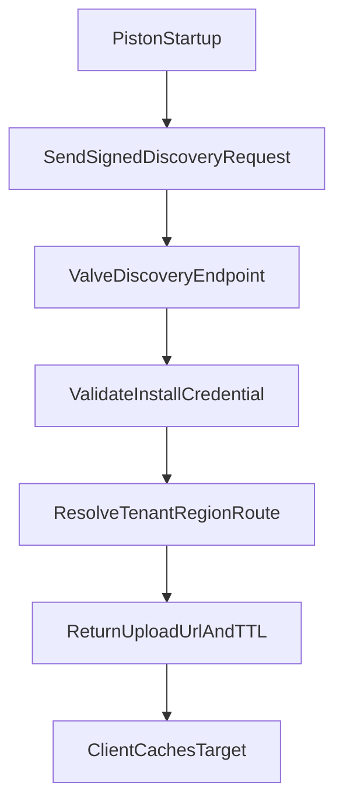

# Valve Repo Plan: Upload URL Discovery Service

## Goal
Provide a control-plane discovery endpoint that maps a valid provisioned install identity to the current Manifold upload URL, so piston can fetch routing at startup without reprovisioning.

## Scope
- Add a discovery API in Valve (or Valve-adjacent control-plane service) that returns the upload target for a validated install id/credential.
- Support dynamic routing (tenant/region/cluster) and endpoint rotation.
- Return TTL metadata so clients can cache safely.

## API Contract (proposed)
- **Endpoint**: `POST /v1/piston/upload-target`
- **Auth/Input**: provisioned install credential + install id (or signed token containing both)
- **Response (200)**:
  - `upload_url` (absolute HTTPS URL)
  - `expires_at` (RFC3339 timestamp)
  - `ttl_seconds` (integer)
  - `routing_version` (string, optional)
- **Failure classes**:
  - `401/403` invalid or revoked credential
  - `404` unknown install
  - `409` tenant/account mismatch
  - `5xx` transient control-plane failure

## Data and Control Flow

## Implementation Steps
- Define request/response schema and error taxonomy in Valve API docs and shared types.
- Implement credential validation + install identity binding in discovery handler.
- Add routing resolver that selects active Manifold ingest URL per tenant/region.
- Add URL validation/allowlist enforcement before returning `upload_url`.
- Add response caching headers and explicit TTL field semantics.
- Add observability: request count, latency, status breakdown, routing_version frequency, and auth-failure counters.

## Security and Reliability
- Require HTTPS and signed/authenticated requests only.
- Enforce strict host allowlist for returned `upload_url`.
- Make routing table updates atomic; avoid partial rollout states.
- Ensure idempotent, low-latency endpoint suitable for client startup path.

## Test Plan
- Unit tests for auth validation and tenant/install binding checks.
- Unit tests for route resolution (normal, migrated, and revoked cases).
- Contract tests for response schema and error payloads.
- Integration test proving endpoint rotation takes effect without client reprovisioning.
- Load test for startup burst scenarios.

## Deliverables for Valve Agent
- Discovery endpoint implementation.
- API contract documentation.
- Monitoring dashboard + alert thresholds.
- Migration notes for clients adopting discovery.